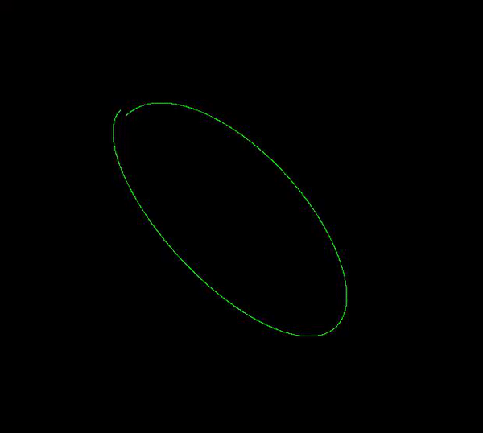

# XYoscillator
oscillator simulator in XY mode

<!-- GETTING STARTED -->
## Getting Started


### Prerequisites

* python3.x
* pip3
* ```sh
   pip3 install soundfile
   ```
* ```sh
   pip3 install opencv-python
   ```  


### Installation

1. Clone the repo
   ```sh
   git clone https://github.com/orelyehuda/XYoscillator.git
   ```
   

<!-- USAGE-->
## Usage
 ```sh
   python3 main.py
```


DEMO

1.

